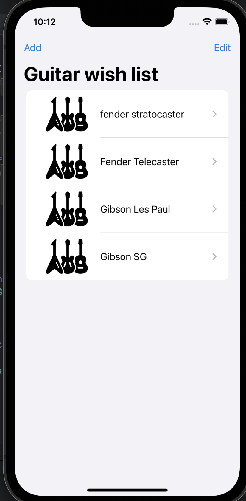
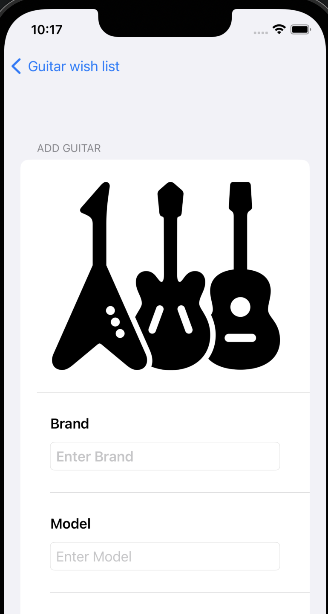
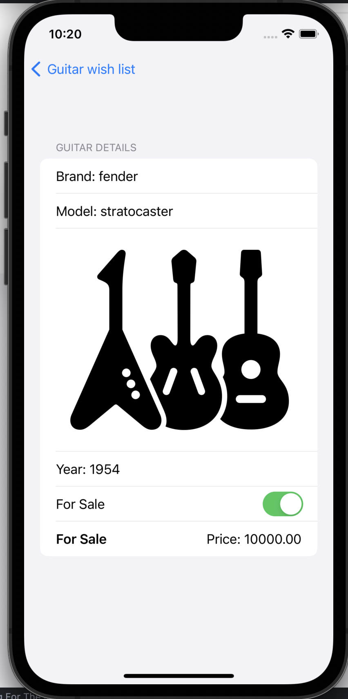

#  This is a simple list of guitars project implimented using SwiftUI.
## it features the following:
- A list of guitars with their images and details.
- The ability to add and remove new guitars to the list.
- The ability to move guitar position in the list.

## Screenshots
# List view

# Add view

# Item view

